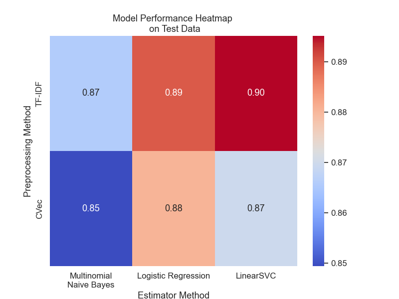
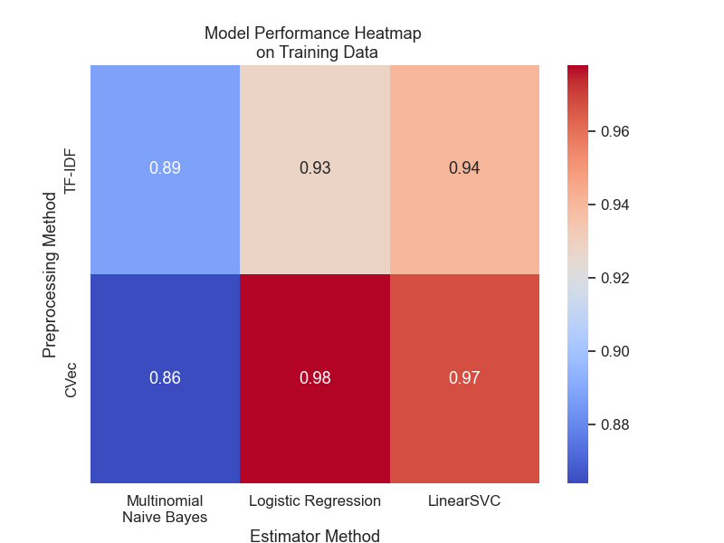

# Classifying human-generated vs AI-generated text

**For this project I attempted to simulate a task that might be asked of a data scientist to determine what proportion of users on a website are actual human users and how many are bots. To do this, first I collected approximately 5000 question-answer pairs from Reddit using the Python Reddit API Wrapper. Then I fed the questions collected from Reddit to ChatGPT using the OpenAI API and collected the responses. Using the responses from Reddit and ChatGPT I trained a Natural Language Processing machine learning classifier model capable of predicting whether a response came from a human or AI. Finally, I provided insights and conclusions based on the work carried out.**

****

## Executive summary

Using the Python Reddit API Wrapper - a.k.a. PRAW - I collected 5250 question and answer pairs from various subreddits. 
The subreddits I collected QA pairs from were: AskReddit, AskScience, AskHistorians, Ask_politics, and AskCulinary.
I also used AskUK, AskStatistics, AskScitech as subreddits to make test calls to the API.
I created a loop to collect attributes from the 999 top comments in each subreddit. 
The attributes for each post that I collected were the post title, main text of the subreddit post, when the post was created ('created_utc'), and the top response to the post, as well as how many upvotes the top response received. 

---

After collecting the Reddit Q/A pairs I used the OpenAI API to feed te questions to the DAVINCI model. 
I utilized the python backoff module and submitted the reddit questions in batches of 20 to stay below the rate limit set by the API. 

---

After collecting all the pertinent data I carried out data cleaning, which included removing reddit posts and responses that had been [deleted] or [removed]. And removed '\n' and '\\_' from all the posts.
I then labeled answers as either AI generated (1) or not (0).

---

I used pipelines and gridsearches to find optimal hyperparameter values for the various models I generated. Overall I fit 10 classification models: Multinomial Naive Bayes, Logistic Regression, Bernoulli Naive Bayes, and Linear Support Vector Classification with Countvectorizer preprocessing and Multinomial Naive Bayes, Logistic Regression, Gaussian Naive Bayes, K-nearest neighbors, and Random Forest with TFID Vectorizer.

---
## Discussion
One half of the responses in the dataset were human-generated and the other half were generated by AI, therefore the accuracy baseline against which to compare any models created is 0.5. In other words, if a response was randomly selected from the dataset there is a 50% chance that it was generated by human and 50% it was generated by chatgpt, so any models should at least perform better than that to be considered useful.
 
The 'best' performing models were the logistic regression model and LSVC with TFID vectorizer preprocessing (see below). Those two models generally performed well at predicting whether a response was generated by a human or chatgpt (Accuracy: 0.8898 and 0.8951 on test data, respectiveley) and compared to many of the other models developed for this project, were not too overfit (Accuracy scores of 0.9277 and 0.9405 on training data, respectively).

I relied on accuracy (the ratio of correct predictions to the total number of predictions made) as the primary meetric for determining model performance primarily because 1) it is very easy to interpret and to convey to others what it means, 2) the dataset is perfectly balanced (50/50 human to ai), meaning there is no concern of models randomly predicting a majority class more often than a minority class, and 3) False predictions in this case will not have too harmful of an effect (compared to say, a medical-related classification problem), in which case one might rely more on Precision, Recall, or Specificity to evaluate model performance.

***
**Below see metrics of the best performing models**

**Logistic Regression with TF-IDF Vectorizer**
>Accuracy: 0.8898,
Precision: 0.8773,
Recall: 0.9060,
Specificity: 0.8736,
F1 Score: 0.8914

**Linear Support Vector Classifier with TF-IDF Vectorizer**
>Accuracy: 0.8951
Precision: 0.8779
Recall: 0.8578
Specificity: 0.8810
F1 Score: 0.8810

---

**Heatmaps comparing model accuracy**

---

## Recommendations, Conclusions, and Next Steps

Accuracy is a reasonable metric by which to evaluate model performance given that the training data is perfectly balanced between the positive and negative class and misclassification is relatively incocuous in this situation.

***

In a scenario like the one presented in the problem statement of a data scientist asked to determine human users vs bots, if a misclassification were to be made, for example, if a human user was identified as a bot and their account disabled, it would be relatively straight-forward to implement an appeal process whereby a user's account is reactivated. So relying on accuracy as the primary metric for model evaluation would be acceptable.

***

Next steps to improve model performance could include more data exploration and cleaning to determine if there are certain words, phrases or syntax that are only used by either humans or AI, removing them from the dataset and fitting a new set of models on the more thoroughly cleaned data. It would also be worth-while to continue tuning hyperparameter values. 

